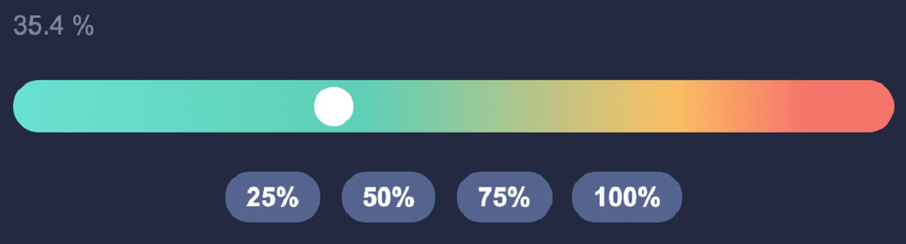
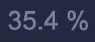

# vue-component
Реализовать полностью кастомный “Range Input” аналог <input type=”range”>
На выходе это должен быть  Vue-component (не npm пакет, а просто компонент). Работать должен как на десктопе так и на мобильной версии. На вход компонента должно поступать начальное значение процента. Компонент должен иметь возможность использовать директиву v-model (естественно что в событии должен передаваться текущий процент). Цветовая палитра не принципиальна.

Компонент состоит из:

⦁	Текущее значение

⦁	Сам слайдер:

⦁	Кнопки установки указателя слайдера (при нажатии установить текущее значение)

